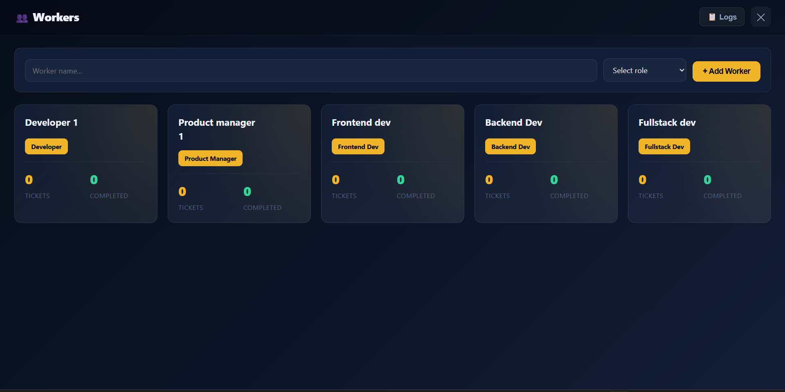
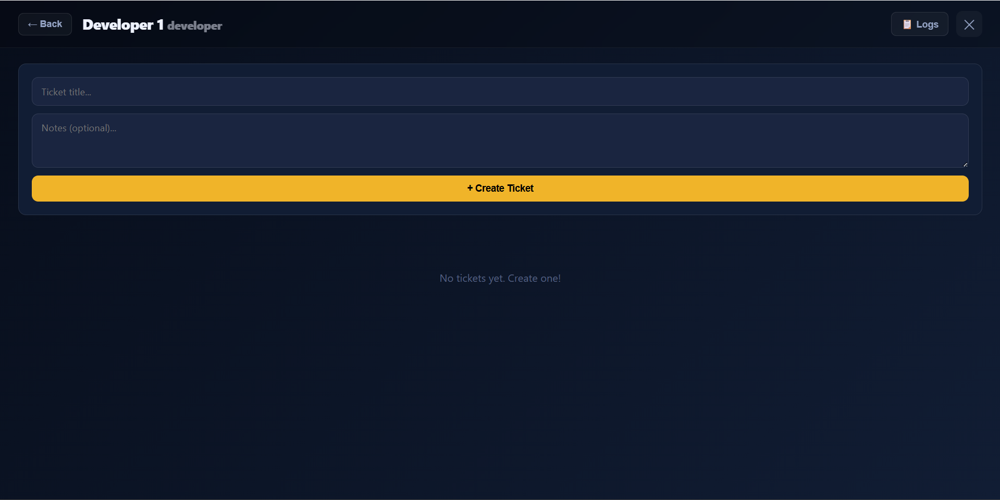
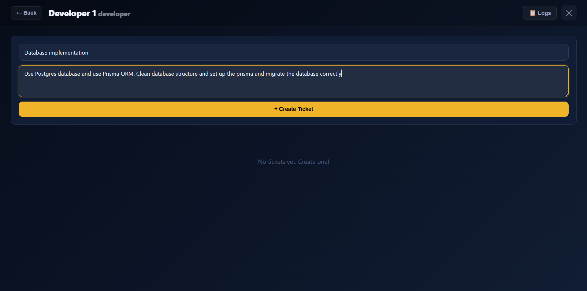
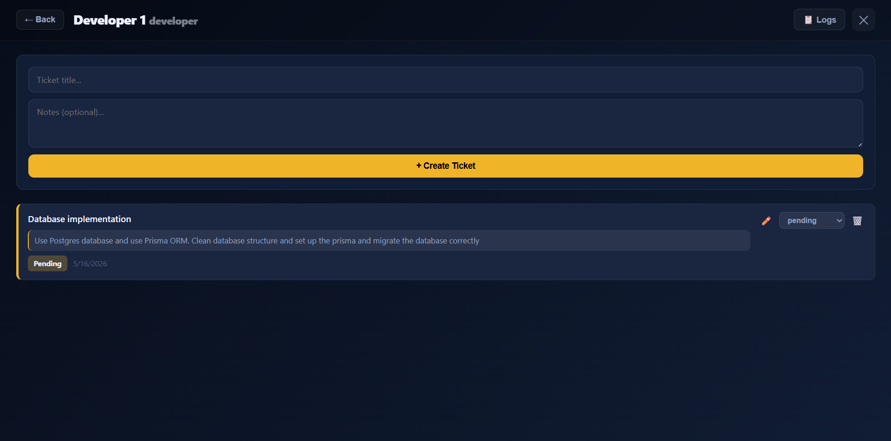
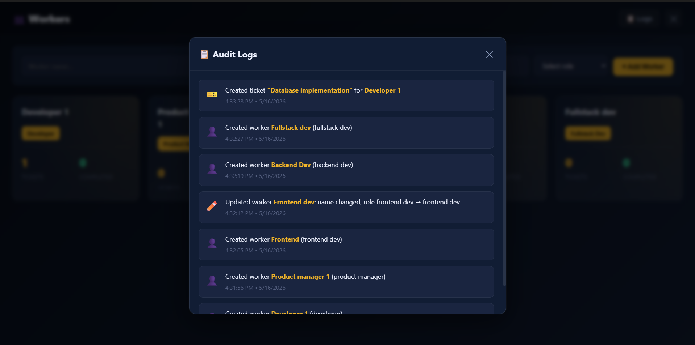

# UI Preview

# 1.1 V

- [Workspace Tool]

- [Create ticket for workers]

- [Input the ticket title and descriptions]

- [Created the ticket and manage status]

- [Global logs for each process]

---
